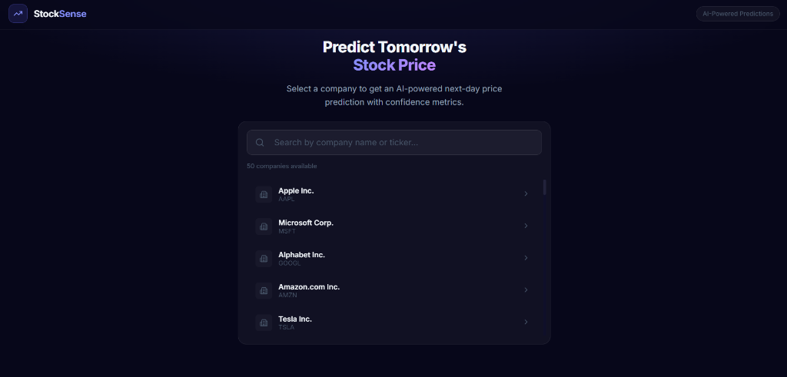
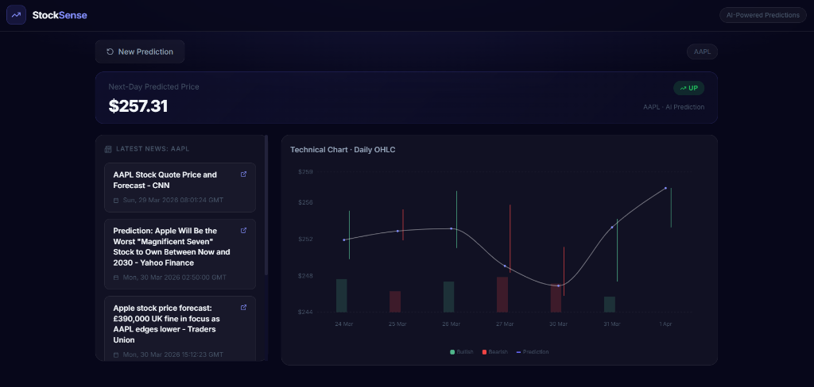

# 📈 Sentiment Stock Predictor

A full-stack stock prediction application that forecasts **next-day stock price and direction** using a fast, lightweight stacked machine learning model.

Built with:

* ⚡ FastAPI (Backend)
* ⚛️ React + Vite (Frontend)
* 📊 Gradient Boosting (ML Model)
* 🌐 Finnhub API (Market Data)

---

## 📸 Screenshots

### 🔍 Search & Select


### 📊 Professional Analysis Dashboard


---


## 🚀 Features

* 📉 Predict next-day stock **price**
* 📈 Predict stock **direction (UP / DOWN)**
* ⚡ Fast inference (no heavy deep learning models)
* 📊 Interactive price visualization
* 🗂️ Prediction history tracking (database)
* 🔌 REST API with FastAPI

---

## 🧠 Model Overview

This project uses a **single stacked model approach**:

* **GradientBoostingClassifier** → Direction prediction
* **GradientBoostingRegressor** → Price prediction

### Why this approach?

* Faster than LSTM / Deep Learning
* No GPU required
* Stable and production-friendly
* Eliminates dependency issues (TensorFlow, PyTorch)

---

## 📁 Project Structure

```
sentiment-stock-predictor/
│
├── backend/
│   ├── app/
│   │   ├── routers/
│   │   ├── database/
│   │   ├── config.py
│   │   └── main.py
│   ├── scripts/
│   │   └── train_and_evaluate.py
│
├── frontend/
│   ├── src/
│   │   ├── components/
│   │   ├── api/
│   │   └── App.tsx
│
└── README.md
```

---

## ⚙️ Setup Instructions

### 1️⃣ Clone the Repository

```bash
git clone https://github.com/anjalipriyad/sentiment-stock-predictor.git
cd sentiment-stock-predictor
```

---

### 2️⃣ Backend Setup

```bash
cd backend

python -m venv venv
venv\Scripts\activate   # Windows
# source venv/bin/activate  # Mac/Linux

pip install -r requirements.txt
```

---

### 3️⃣ Environment Variables

Create a `.env` file in the root:

```env
FINNHUB_API_KEY=your_finnhub_api_key
```

---

### 4️⃣ Run Backend

```bash
uvicorn backend.app.main:app --reload
```

API available at:

```
http://localhost:8000
```

Swagger docs:

```
http://localhost:8000/docs
```

---

### 5️⃣ Frontend Setup

```bash
cd frontend
npm install
npm run dev
```

Frontend runs at:

```
http://localhost:5173
```

---

## 🔌 API Endpoints

### 🔹 Predict Stock

```
GET /predict/{ticker}
```

**Response:**

```json
{
  "ticker": "AAPL",
  "model": "stacked",
  "predicted_price": 182.34,
  "predicted_direction": "up",
  "metrics": {
    "price": { "MAE": ..., "RMSE": ..., "R2": ... },
    "direction": { "accuracy": ..., "precision": ..., "recall": ..., "f1": ... }
  }
}
```

---

### 🔹 Prediction History

```
GET /predict/history/{ticker}
```

---

### 🔹 Fetch Market Data

```
GET /fetch/{ticker}
```

---

## ⚡ Performance Improvements

* ❌ Removed TensorFlow & LSTM models
* ❌ Removed repeated BERT computations
* ✅ Single lightweight model
* ✅ Finnhub API for faster data fetching
* ⚡ ~10x faster predictions

---

## 🧪 Running Model Directly

```bash
python scripts/train_and_evaluate.py --ticker AAPL
```

---

## 📊 Frontend Features

* Stock ticker search
* Real-time prediction display
* Interactive chart (Recharts)
* Prediction history visualization

---

## 🔐 Notes

* Do NOT commit `.env` file
* Uses SQLite by default (can switch to PostgreSQL)
* Designed for educational and experimental use

---

## 🚀 Future Improvements

* 📡 Real-time streaming predictions
* 🤖 Advanced ensemble models
* 📊 Portfolio optimization
* ☁️ Deployment (Render / Vercel)

---

## 👩‍💻 Author

**Anjali Priyadarshi**
B.Tech IT | Full Stack + ML

---

## ⭐ Contributing

Pull requests are welcome. For major changes, please open an issue first.


