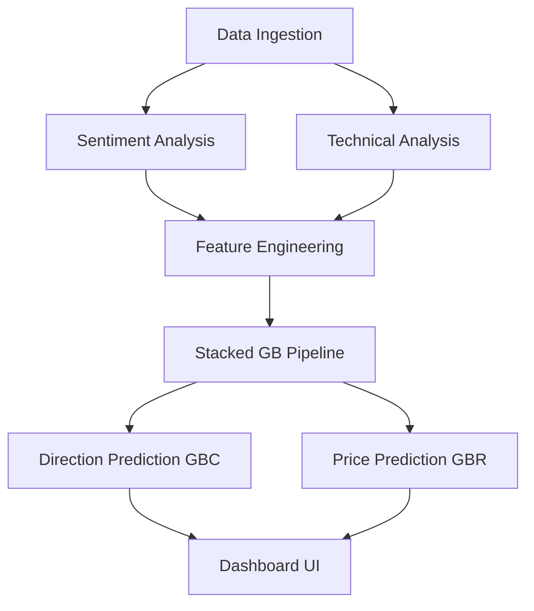
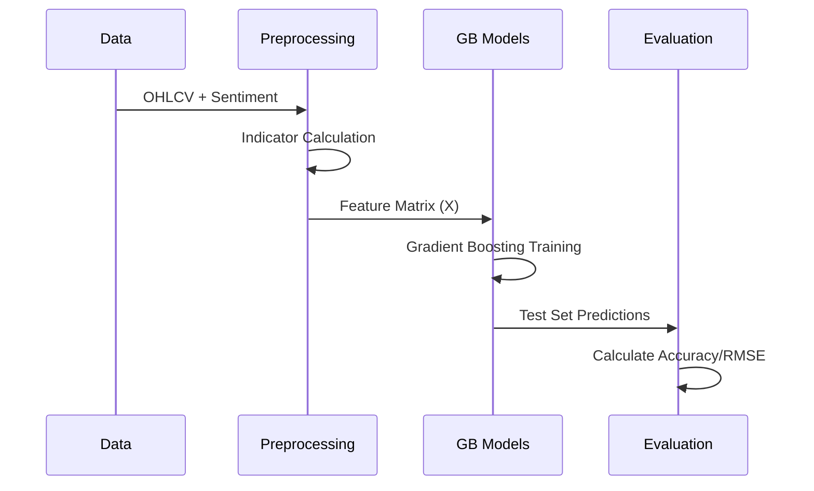

# 🧠 Sentiment Stock Predictor: Model Architecture

This document provides a detailed technical overview of the Machine Learning pipeline used in the Sentiment Stock Predictor application. The system follows a modular architecture that combines traditional technical market indicators with NLP-driven sentiment analysis.

---

## 📈 High-Level Pipeline Flow

---

## 1. Data Ingestion Layer

The system consumes data from two primary channels:
- **Historical Market Data**: Fetched via the `yfinance` library, retrieving Daily OHLCV (Open, High, Low, Close, Volume) data for the past 2 years.
- **Market Sentiment**: Fetched via the `NewsAPI` (or Google News RSS fallback), retrieving the latest 100 headlines relevant to the specific ticker.

---

## 2. Sentiment Analysis Engine

The model uses a dual-layered approach to sentiment:

### Lexicon-Based Scoring
A fast, lightweight lexicon scanner that identifies bullish and bearish keywords:
- **Positive**: *gain, rise, up, positive, growth, bull, surge*
- **Negative**: *fall, down, loss, negative, drop, bear, decline*

### BERT Embeddings (Optional/Advanced)
The system is capable of using `DistilBERT` (via the `transformers` library) to generate high-dimensional (768-dim) embeddings of news titles, capturing nuanced context that local keyword matching might miss.

---

## 3. Feature Engineering

The "Feature Matrix" ($X$) is constructed by joining market data with sentiment scores and calculating the following technical indicators:

| Category | Indicators |
| :--- | :--- |
| **Momentum** | RSI (14-day), Returns (1-day, 3-day), Momentum Oscillator |
| **Trend** | MA5, MA20, EMA12, EMA26 |
| **Volatility** | 3-day and 7-day rolling Standard Deviation |
| **Volume** | Volume Spike Ratio (Current / 5-day average) |
| **MACD** | MACD Line, Signal Line, and MACD Histogram |
| **Sentiment** | Normalized daily sentiment score (from News headlines) |

---

## 4. Modeling Stack

The core of the predictor is a **Stacked Gradient Boosting** architecture. This was chosen over deep learning (LSTM/RNN) because it provides better stability on small-to-medium tabular datasets and requires zero GPU overhead.

### A. Classification Model (Direction)
- **Algorithm**: `GradientBoostingClassifier`
- **Objective**: Predict if the stock will be **UP** or **DOWN** in the next 3 days.
- **Target Logic**:
  - $1$ (UP) if 3-day return $> 0.2\%$
  - $0$ (DOWN) if 3-day return $< -0.2\%$

### B. Regression Model (Price)
- **Algorithm**: `GradientBoostingRegressor`
- **Objective**: Predict the **Next-Day Closing Price**.
- **Target Logic**: Shifted 'Close' price by -1 day.

---

## 5. Training & Evaluation

The pipeline splits data chronologically (80% Train / 20% Test) to prevent data leakage. 

### Performance Metrics
The system evaluates performance using industry-standard metrics:
- **Classification**: Accuracy, Precision, Recall, F1-Score.
- **Regression**: Mean Absolute Error (MAE), Root Mean Squared Error (RMSE), and R² Score.

---

## 6. Inference Flow (Live App)

When a user selects a company in the frontend:
1. The **Backend** triggers `run_pipeline_stacked`.
2. It fetches the **most recent** data point.
3. The trained models are loaded (or retrained on the fly).
4. The models output a **Probability** (for direction) and a **Scalar** (for price).
5. The result is cached in the local database and displayed on the interactive dashboard.
